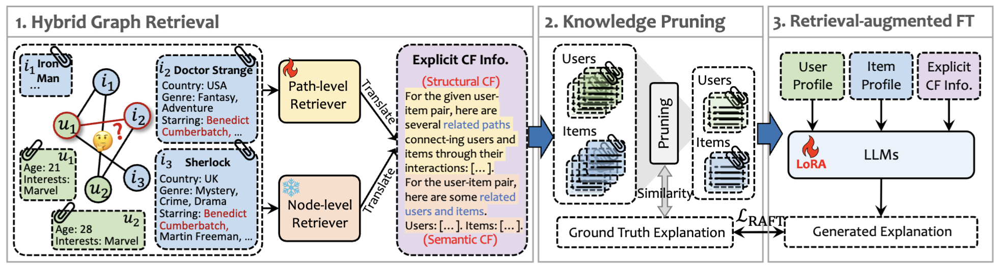

<h1 align="center"> G-Refer: Graph Retrieval-Augmented Large Language Model for Explainable Recommendation </h1>

This repo contains the code for WWW'25 Oral paper "G-Refer: Graph Retrieval-Augmented Large Language Model for Explainable Recommendation".

G-Refer is a novel framework using **Graph Retrieval-augmented Large Language Models** for **explainable recommendation**. Specifically, G-Refer first employs a hybrid graph retrieval mechanism to retrieve explicit CF signals from both structural and semantic perspectives. To bridge the modality gap, knowledge pruning and retrieval-augmented fine-tuning are introduced to enhance the ability of LLMs to process and utilize the retrieved CF information to generate explanations. 

For more details, check out our paper <a href="https://arxiv.org/abs/2502.12586">here</a>!



## Setup Environment

```shell
conda create -n g-refer python=3.11
conda activate g-refer
pip install -r requirements.txt
```

Setup LLM API keys: For GPT-score evaluation, OpenAI API key is optional and set it when you want to use their open-source models (e.g., GPT-3.5-turbo).

In `evaluation/metrics.py`:
```shell
api_key='Add your own OpenAI API key here.'
api_base='Add the API base here.'
```

To use LLaMA-series for retrieval-augmented fine-tuning, download the pretrained [checkpoint](https://huggingface.co/meta-llama/Meta-Llama-3-8B) and put it at any path. Remember to change the args of the training scripts `ds_training/single_node/run_{dataset}.sh`:

```shell
--model_name_or_path your_llama_path \
```

## Setting up your data

Hybrid Graph Retrieval on three datasets require some computation resource and time. If you want to explore G-Refer, we recommend you to download the processed datasets and retrieved paths/nodes and directly run retrieval-augmented fine-tuning. You can download all related files from [here]().

Please place the downloaded `saved_models` and `saved_explanations` folders under the `path_retriever` directory. Please place the downloaded `data` and `raft_data` folders under the G-Refer root.

## Using G-Refer

**Note that the working directory is G-Refer root for the following commands.**

If you already download the retrieved data, you can directly goto **Step 7**.

### Step 1: Dataset Conversion

```
python Retriever/converter.py --dataset yelp --split trn --text_encoder SentenceBert
```

### Step 2: Graph extraction

```
python Retriever/dgl_extractor.py --dataset yelp --split trn 
```

### Step 3: GNN training

```
cd path_retriever/
python train_linkpred.py --dataset_name yelp --split trn --save_model
```

### Step 4: Explanation Path Extraction

```
python pagelink.py --dataset_name yelp --split trn --save_explanation --device_id 0
```

### Step 5: Explanation Node Extraction

```
python Retriever/dense_retriever.py --dataset yelp --split trn
```

### Step 6: Translation and Pruning

```
python Retriever/translation.py --dataset yelp --split trn --k 2
```

### Step 7: RAFT

```
cd ds_training/step1_supervised_finetuning/
bash run_yelp.sh
```

Execute Steps 1-6 on the test set, following the same procedure as the train set.

### Step 8: Inference

```
cd ds_inference/
bash infer.sh
```

### Step 9: Evaluation

```
cd ..
python evaluation.py --dataset yelp
```


## Contact

Questions or issues? File an issue or contact 
[Yuhan Li](yuhanli98@gmail.com),
The Hong Kong University of Science and Technology (Guangzhou)

## Citation

If you find this work useful, please consider citing our paper:

```
@article{li2025g,
  title={G-Refer: Graph Retrieval-Augmented Large Language Model for Explainable Recommendation},
  author={Li, Yuhan and Zhang, Xinni and Luo, Linhao and Chang, Heng and Ren, Yuxiang and King, Irwin and Li, Jia},
  journal={arXiv preprint arXiv:2502.12586},
  year={2025}
}
```
